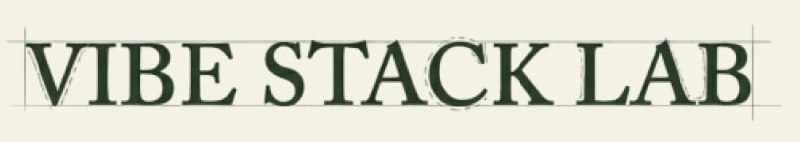

  

# vsl-library

Skills, tools, and workflows for the Vibe Stack Lab ecosystem.

## Skills

### prepublish-fact-checker

Pre-publication fact-checking workflow for Substack and article content. Validates claims, sources, and data before hitting publish.

## Usage

Each skill is a self-contained directory under `skills/` with its own SKILL.md that includes setup, instructions, and reference files.
